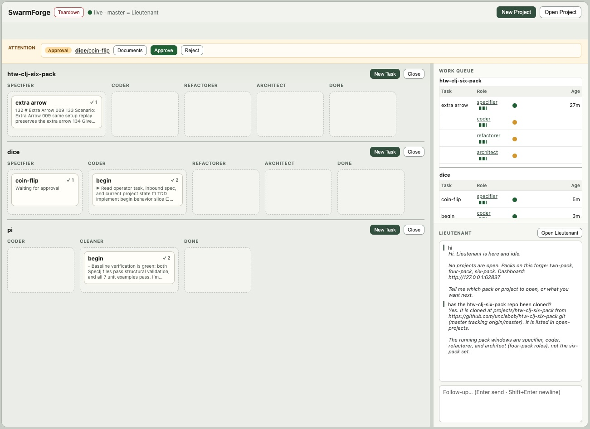

<p align="center" style="color: red; font-weight: bold; font-size: 2em; font-style: italic; text-decoration: underline;">
不要为 bankrbot 的 SWARM token 花任何钱。
</p>

# SwarmForge

SwarmForge 在互相隔离的 git worktree 与 tmux session 里协调 AI agent。agent 之间通过
durable handoff 交换已提交的工作，而 operator 用一个本地 dashboard 派活、观察 agent、
处理审批闸、回答澄清，以及停掉 swarm。

> 英文原文在 [`README.en.md`](README.en.md)。upstream 改动 README 时先合那一份，再照它
> 更新这一份。



本仓库的主干分支叫 `main`。它是落地页、安装器来源、共享 runtime 与共享工程法，**它本身
不是一个可运行的 SwarmForge 产品**。

## 产品

| 命令 | 分支 | 形态 |
|---|---|---|
| `get-swarm-forge two-pack` | [`two-pack`](https://github.com/unclebob/swarm-forge/blob/two-pack/README.md) | 装进当前 project 的 pack：`coder` → `cleaner`。 |
| `get-swarm-forge four-pack` | [`four-pack`](https://github.com/unclebob/swarm-forge/blob/four-pack/README.md) | 装进当前 project 的 pack：`specifier` → `coder` → `refactorer` → `architect`。 |
| `get-swarm-forge six-pack` | [`six-pack`](https://github.com/unclebob/swarm-forge/blob/six-pack/README.md) | 装进当前 project 的 pack：specification、implementation、cleanup、architecture、hardening、QA 六个独立角色。 |
| `get-swarm-forge project-manager` | [`project-manager`](https://github.com/unclebob/swarm-forge/blob/project-manager/README.md) | 多 project 的 forge，可选 two/four/six-pack 模板，带一个 host lieutenant。 |
| `get-swarm-forge lieutenant` | [`lieutenant`](https://github.com/unclebob/swarm-forge/blob/lieutenant/README.md) | 多 project 的 forge，只有一个可配置的 project 模板，带一个会做规划的 lieutenant。 |

**pack** 是组装进一个已有 project 的。跑 `./swarm` 启动那个 project 配好的角色。

**forge** 是装进一个空目录的。跑 `./swarm` 启动 forge 的 dashboard 与 host lieutenant；
各 project 的 swarm 要等 operator 在 `projects/` 下面创建或打开 project 时才启动。

`squad`、`sprint-module-squad`、`adversaries` 三条分支是独立的实验性工作流，**不是**
`get-swarm-forge` 的产品。

## 前置依赖

- `zsh`
- `git`
- `tmux`
- Babashka（`bb`）
- 至少配好一个 agent backend：`grok`、`codex`、`claude` 或 `copilot`

## 安装 helper

把 `get-swarm-forge` 放到 `PATH` 上的某个位置：

```sh
mkdir -p ~/cmds
curl -L -o ~/cmds/get-swarm-forge \
  https://raw.githubusercontent.com/unclebob/swarm-forge/main/get-swarm-forge
chmod +x ~/cmds/get-swarm-forge
```

把 `~/cmds` 加进 `PATH`，helper 有更新时重新拷一次。**helper 是受支持的唯一入口**，因为
它要从不止一条分支上组装文件。

## 组装方式

装 pack 时，helper 下载两条分支：

```text
main
  swarmforge/scripts/                    共享 runtime 与 dashboard
  swarmforge/constitution/articles/      共享的 engineering、workflow、handoffs

<pack 分支>
  swarm                                  launcher
  swarmforge/swarmforge.conf             角色、agent 与 worktree
  swarmforge/constitution.prompt         constitution 入口
  swarmforge/constitution/articles/      pack 自己的补充条款
  swarmforge/roles/                       角色职责
```

结果写进当前 project。共享条款 `engineering.prompt`、`workflow.prompt`、
`handoffs.prompt` **永远来自 `main`**；pack 只能用 `project.prompt` 与 `local-*.prompt`
去特化它们。

装 forge 时，被点名的那条 forge 分支提供 host runtime、lieutenant 与 dashboard。
`project-manager` 还会把三条 pack 分支下载进 `packs/`；`lieutenant` 则在
`.swarmforge/project-pack/` 下带着它唯一的那个模板。

## 配置契约

每个运行中的 project 都有一份 `swarmforge/swarmforge.conf`。对固定的几个 pack，每一行
非注释内容是这个形状：

```text
window[-invisible] <role> <backend> <worktree> [task|batch] [forward-only|back-one|back-all] [backend arguments...]
```

- **文件顺序就是默认的正向流水线。** 必须**恰好一个**角色用 `master` worktree；那个
  哨兵值指的是 project 主 checkout 的当前分支。其它名字会变成 `.worktrees/<name>`
  checkout。
- `window` 开一个终端界面；`window-invisible` 只在 tmux 里跑，需要时从 dashboard 打开。
- 接收模式默认 `task`。`batch` 让一个角色把一组兼容的排队 handoff 一起收下。
- 传播模式默认 `forward-only`。`back-one` 与 `back-all` 会在下游干完活之后，给前面的
  角色排一份只做 merge 的副本。
- 支持的 backend 是 `codex`、`grok`、`claude`、`copilot`；这一行剩下的 token 原样传给
  那个 backend。

forge host 用的是另一种写法：`Lieutenant <backend> [backend arguments...]`。各分支可以
为自己的控制面扩展这套语法——比如 `lieutenant` 加了带类型的 `card` route，squad 系列加了
`swarmforge/squad.conf`。**那些扩展以对应分支的 README 和它的 parser 为准。**

## Constitution 与角色 prompt

安装器把指令当成数据来组装，**不把每个产品的规则烤进 launcher**。一个普通的 pack agent
启动时拿到的指令是：读 `swarmforge/constitution.prompt`，递归读它点名的东西，然后读
`swarmforge/roles/<role>.prompt`。

`main` 拥有的三条条款是：

| 条款 | 共享职责 |
|---|---|
| [`engineering.prompt`](swarmforge/constitution/articles/engineering.prompt) | 语言默认值、可测性、验收流水线工具、验证，以及质量工具的护栏。 |
| [`workflow.prompt`](swarmforge/constitution/articles/workflow.prompt) | worktree 纪律、commit 署名、临时文件，以及失败条件。 |
| [`handoffs.prompt`](swarmforge/constitution/articles/handoffs.prompt) | 结构化的发送、接收、合并、重试与完成协议。 |

产品分支贡献它自己的 constitution 入口，以及任何**换了名字的**本地条款，比如
`project.prompt`、`local-engineering.prompt`、`local-workflow.prompt`。组装器把上面那三个
共享名字保留给 `main`，所以**一个 pack 无法悄悄替换掉共同法**。产品的 README 只描述它的
本地条款加了什么，不重复这些共享规则。

角色 prompt 在那套法之内划分职责：一个角色可以改什么、必须验证什么、必须留给别的角色
什么，以及它的下一个 handoff 去哪。**每个配置在案的角色都必须有一份对应的 prompt。**
forge lieutenant 是例外：共享的
[`lieutenant.prompt`](swarmforge/roles/lieutenant.prompt) 明确把它放在 project 工程
constitution 之外。

## 用一个产品

在一个已有的软件仓库里装 pack：

```sh
get-swarm-forge six-pack
./swarm
```

或者在一个空目录里装 forge：

```sh
get-swarm-forge lieutenant
./swarm
```

所选产品的 README 描述它的 route、角色、worktree、project 生命周期与 dashboard 行为。
**当前的 backend 分配与拓扑以分支配置为准，不以本 README 为准。**

## `main` 拥有什么

```text
get-swarm-forge                         产品组装器
swarmforge/scripts/                    launcher、dashboard、board、handoff
swarmforge/constitution/articles/      共享的 agent 规则
swarmforge/handoff-protocol.md         durable handoff 协议
test/                                  共享 runtime 测试
```

对共享的启动、dashboard、终端、worktree、board 或 handoff 行为的改动，**先落在 `main`
上**。pack 分支只拥有它自己的配置、本地 constitution 补充、角色 prompt 与 launcher。
forge 分支带着独立安装所需的共同文件，那些文件变化时应当从 `main` 刷新。

**不要用自动测试去钉 prompt 的措辞。** 测可观察的 runtime 行为。

## Runtime 组件与生成态

共享 runtime 按职责划分：

| 组件 | 职责 |
|---|---|
| `swarmforge.sh` / `swarmforge.bb` | 解析配置、创建 worktree 与 tmux session、同步受管文件、启动 agent。 |
| `swarm_handoff.*`、`ready_for_next.*`、`done_with_current.*` | 创建、接收、合并、审计与完成 durable 工作项。 |
| `handoffd.*` | 投递排队的 handoff，并唤醒接收方 session。 |
| `pack_board.*`、`pack_web.*`、`pack/dashboard.html` | 持久化并呈现卡片、审批、澄清、agent pane 与控件。 |
| `forge.*` | 在一个 forge 产品内部创建、打开、刷新与停止 project。 |
| 终端适配器、watchdog 与清理脚本 | 暴露 pane、监控 session，以及干净地关掉 swarm。 |

启动时，组装好的 runtime 会校验配置、必要时初始化 git、创建角色 worktree、把受管的
SwarmForge 文件镜像进去、创建互相隔离的 tmux session、启动 handoff daemon 与本地
dashboard，然后拉起每一个配置在案的 agent backend。

角色配置里的 `master` 指的是 project 主 checkout 的当前分支；**它是一个 worktree 哨兵，
不是一个必须存在的 git 分支名**。生成的传输与进程状态放在 `.swarmforge/` 下；生成的角色
checkout 放在 `.worktrees/` 下。`.swarmforge/` 里是角色/session 映射、tmux socket、
handoff 收发箱、board 数据、审批、澄清、daemon 状态与 dashboard 状态这类 runtime 记录。
**它不是产品源码，agent 不得用编辑它来代替 helper 命令。**

agent 用 `swarm_handoff.sh` 发送已提交的工作，用 `ready_for_next.sh` 接收，用
`done_with_current.sh` 结束当前项。消息格式、审计、投递、重试、合并与生命周期细节见
[handoff 协议](swarmforge/handoff-protocol.md)。

`simple-windows` 这个 tag 标记的是 dashboard cockpit 之前 `main` 的最后一个快照。它是
历史记录，不是 `get-swarm-forge` 的产品。

## 从你的笔记本操作一个运行中的 swarm（本 fork 独有）

本 fork 带着 `.agents/skills/swarmforge-operator/`——一个给本地 agent 会话用的控制面
skill，通过 ssh 驱动一个运行中的 SwarmForge project。**upstream 没有这东西。**

这个 skill **只服务 `lieutenant` forge**。它不装 pack，也不派活；见
[ADR-0007](docs/adr/0007-the-fork-keeps-only-the-lieutenant-forge-path.md)。

六个 verb，一张跨 verb 唯一的退出码表，以及 dashboard 端口分配：

| Verb | 只有它能做的事 |
|---|---|
| `provision forge` | 在空目录里装好并启动一个 forge，然后建它的第一个 project。**那一刻 dashboard 还不存在。** |
| `dashboard` | 让 dashboard 可达：一条 ssh local-forward 或一次 tailnet 发布，外加一个 browser surface。`pack_web` 只绑 `127.0.0.1`。 |
| `open swarm` | 把终端附着到一个角色上。dashboard 的 agent pane 是**只读 capture**。 |
| `wake role` / `talk role` | **往角色的 pane 里打字。** 没有任何 HTTP 端点能给 project 角色送文本，chat rail 只通到 host lieutenant。 |
| `ship project` | 推走干完的活并开 PR。upstream 的生命周期在 board 卡片进入 Done 时就停了。 |

**其余动作都在 dashboard 里做**，而且它做得更好：停止或启动一个 project、拆掉整个
forge、读角色状态、切卡、回答澄清。**从 dashboard 停 project 还会同时维护 forge 自己的
`open-projects` 记录，这是任何外部命令都做不到的。** dashboard 在结构上覆盖不了的那两个
盲区——够不到自己，以及打不了字——记在
[ADR-0008](docs/adr/0008-the-dashboard-cannot-reach-itself-or-type.md)。

见[operator runbook](docs/operator-runbook.md)。runbook 是中文的；skill 本身才是可执行的
契约。
