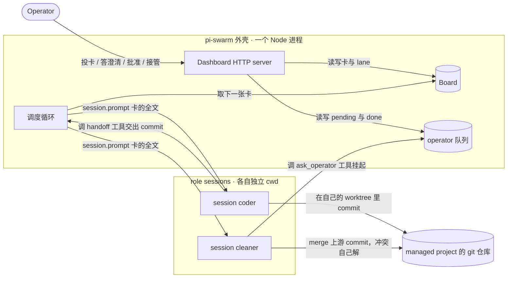
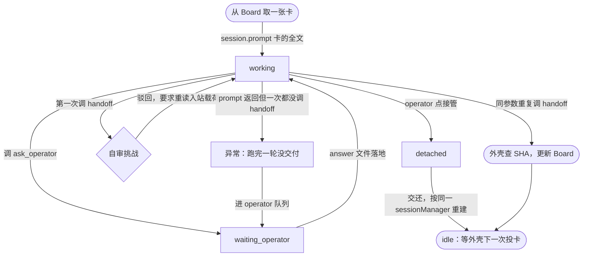

# pi-swarm 实现 spec

把 swarm-forge 移植成一个基于 pi 的等价项目。这份文档是
[wayfinder 地图 #181](https://github.com/arlishansenn/swarm-forge/issues/181) 九张决策票走完之后的
终点产物：**决策已经定完，剩下的是实现。**

每条决定后面括号里的票号是它的权威记录，要细节点进去；这里只写实现需要的形状。

---

## A. 这份 spec 与验收

### A.1 验收判据

**拿一个真项目的一张真卡，从投任务走到 PR，中间至少一次 git handoff、一次操作员澄清。**

不是一张逐条打勾的行为清单。编排是概率性的，清单钉不住（#181 前提 9）。

### A.2 等价最少保住四件

多 role 流水线、Board 是任务状态的唯一权威、git worktree 隔离、Dashboard（#181 前提 4）。

### A.3 底座已被原型证实

[#189](https://github.com/arlishansenn/swarm-forge/issues/189) 用两个常驻 pi SDK session 真跑通了
一次 git handoff，六条要证伪的问题全部成立。原型在丢弃分支
[`worktree-prototype-189`](https://github.com/arlishansenn/swarm-forge/tree/worktree-prototype-189)
的 `prototype/swarm-189/`。**实现之前先把那个原型跑一遍**，它是这份 spec 最短的可执行摘要。

---

## B. 系统形状

### B.1 第一层：部件与流向

operator 只跟 Dashboard 打交道，从不直接碰 role；role 只跟自己那棵 worktree 和外壳打交道，
从不直接碰 Board。这两条隔离是下面所有协议成立的前提。



### B.2 仓库与装法

**`arlishansenn/pi-swarm`**，本地 `/Users/admin/project/pi-swarm`，**全 TypeScript/Node**，
**只有一条 `main`**（#187、#188）。

**managed project 里零文件。** pi-swarm 是一个**指着项目跑的 npm CLI**，不是装进项目的东西。
这跟 swarm-forge 是相反的：

```diff
 swarm-forge：把脚本快照拷进 managed project
   managed-project/
-  ├── swarm                                    # launcher
-  ├── swarmforge/scripts/*.bb                  # 脚本快照
-  └── .worktrees/<role>/swarmforge/scripts/    # 每棵 role worktree 再拷一份

 pi-swarm：什么都不装
   managed-project/
+  └── （零文件）
```

装法消失的原因是两条已定的决定：role 的工具是**注入 session 的 custom tool**（#189），Board 在
**外壳目录里、role 的 `bash` 够不着的地方**（#190）。所以 `get-swarm-forge` 那 284 行组装逻辑与
`./swarm` launcher 一起没有了。

**顺带消掉一条事故**：`docs/fork-deltas.md` 的 **D-9**（managed project 必须从本 fork 拿快照，
装了 upstream 的树 handoff 链会死锁）在没有快照之后自动不存在。

**代价**：没法再靠「项目里有没有 `swarmforge/scripts/`」判断一个项目装没装，实现时要另找判据。

### B.3 跟 pi-governance 的关系：单向

pi-governance 依赖 pi-swarm，**pi-swarm 不知道 `deploy.py` / `l2ctl` / `join-project` 存在**
（#187）。ADR-0027 刚把编排交给 swarm-forge、治理只保留「声明与部署」，让 pi-swarm 反过来靠治理的
部署机制配 role，等于把刚交出去的编排缠回来。

**pi-swarm 的 role 不是 l2 实例。** 治理的 l2-agent template、skill view、`disabled_skills` 那一套
管的是 `deploy.py` 物化出来的实例，对 pi-swarm 的 role 不适用。

治理侧的远程观察面 `swarm-observer` 读 Dashboard 的 `/api/state`，pi-swarm 不为它定制。

---

## C. 运行协议

### C.1 拓扑配置

沿用 swarm-forge `swarmforge.conf` 的语义，换成 TS 里一个对象数组。字段逐条定生死（#188）：

```diff
- window-invisible                      # tmux 的东西，死
  role                                  # 留
- agent（grok / codex）
+ provider + model                      # ModelRuntime.getModel(provider, id) 解析
  worktree                              # 留 —— 它就是 session 的 cwd
  receive: "task" | "batch"             # 留 —— role 的接收模式是 role 属性
  propagation: "forward-only"           # 留 —— non-forwarding 协议的载体，工具层强制
           | "back-one" | "back-all"    #      （#185 查实它不只是文案约定）
- extra-cli-args（--yolo 之类）          # 死 —— 换成 tools 白名单与权限选项
```

第一个拓扑就是 two-pack 那两行（#188）：

```ts
export const topology: RoleSpec[] = [
  { role: "coder",   provider: "litellm", model: "cd-sonnet-4.6",
    worktree: "master", receive: "task",  propagation: "forward-only" },
  { role: "cleaner", provider: "litellm", model: "cd-sonnet-4.6",
    worktree: "cleaner", receive: "batch", propagation: "back-one" },
]
```

**不做分支发行。** upstream 那五个「产品」是发行单位（一条分支 + 一个 `get-swarm-forge` 参数）；
装法消失之后它们塌缩成两个配置维度——role 拓扑，和有没有 lieutenant 层。一条 `main` 装得下。

**lieutenant 层是加法不是替代**：它在拓扑上就是多一个 role，工具是 Board 而不是 git。底座跑通之后
叠上去，不用重做（#188）。

### C.2 调度循环：role 的一轮

**push，不是 pull。** 外壳 `session.prompt()` 推卡，一张卡一轮（#190）。

[#189](https://github.com/arlishansenn/swarm-forge/issues/189) 实测 pull（role 调一个阻塞的
`wait_for_next_task` tool）**也能跑通**，但 pull 模型下 role 的一生只有一轮，上下文单调增长、
compaction 迟早触发，而 #182 查实 **compaction 之后原始消息对 LLM 不可见**——pull 模型的全部卖点
恰恰是「外壳不重述事实」，卡的原文被吃掉之后 role 没有第二个来源。



**`prompt()` 返回了却一次 `handoff` 都没调 = 异常，不是完成。** 这张卡进 operator 队列。
这是整份 spec 里最要紧的一条机制：#189 实测「遇到歧义问 operator」这类写在 prompt 里的协议
**钉不住**，role 觉得能猜就自己拍板了。push 模型第一次让外壳能从结构上看见「这一轮结束了但没交付」,
所以宪法里「完成后无条件转发」终于有了**执法位置**。

**`turn_end` 事件不能当「这张卡干完了」**——#189 实测它是「一次 LLM 回复 + 那批工具」结束，一张卡里
会来好几次。判据只有「role 显式调了 `handoff`」这一个。

外壳要记的 role 状态就上图这四个：`idle` / `working` / `waiting_operator` / `detached`。
不要再加「等 handoff」之类的状态，那是 pull 模型的产物。

### C.3 事实来源与崩溃恢复

**卡的全文就是 prompt 本身，Board 放在 role 的 `bash` 够不着的地方**（#190）。

role 必须有 `bash`（#189 实测它要用来 `git commit`），靠砍工具集堵不住第二个事实来源；但 role 的
`cwd` 是它自己那棵 worktree，Board 在外壳目录里，它就够不着。**这比「每轮 prompt 里重述」更硬——
后者是纪律，前者是结构。**

**崩溃恢复靠 Board，不靠 session。** 外壳重启后按 Board 重建调度：哪张卡在哪条 lane、下一张投给谁。
session 只是这个 role 的谈话历史。#189 的 resume 测试里 role 确实准确说出了上一步合并的 commit，
但那是 happy path，compaction 之后不保证。**外壳重启后不需要问 role「你干到哪了」。**

### C.4 handoff 协议

载荷是**一个 git commit**，**收件方自己 merge、冲突收件方解**（#181 前提 5）。不用 pi-subagents
那套「临时 worktree 跑完出 patch、orchestrator 应用」。

从 #185 的分类里搬过来的协议条款（这些是协议，不是 harness 适配）：

- 完成后**无条件**转发到下一角色，格式化、manifest、审计这类非功能改动也要转。
- 反向（`non-forwarding`）入站只合并，不再往下转发。
- 转发同一任务时**保留收到的任务名**。
- 合并冲突**全部由接收方解决**，不发明新的合并办法；并行卡撞车是预期行为。
- 遇到歧义问 operator，不自己拍板。**这一条 prompt 钉不住，必须靠结构**（见 C.2 的异常分支）。

**commit SHA 由外壳查，不信 role 报的**（#190）。role 只传分支名，外壳在那棵 worktree 里
`git rev-parse` 拿 HEAD。原则：能由外壳确定的事实不要经过 LLM。

**自审挑战 gate 跟去，形状不变**（#190）。role 第一次调 `handoff` 时工具**拒绝入队**、返回「驳回 +
要你重做什么」，逼它重读入站载荷逐条追溯需求与证据；**只有原样重复提交同一个候选才真的入队**。
它跟 operator 批准 gate 是两回事，价值不在审计本身，在于它是**用结构强制而非指望自觉**的协议。

### C.5 打印令牌：9 个控制令牌全废，12 个字段降级

swarm-forge 里 role 面对的这套文本协议实际有 21 个（不是 `handoffs.prompt` 里写给 role 看的那 5 个）。
完整清单与逐个去留在 [#190](https://github.com/arlishansenn/swarm-forge/issues/190)，这里只给结论：

**控制令牌全死。** `NO_TASK` / `MAIL_WAITING` 随主被动反转一起死；`NO_CURRENT_TASK` /
`NO_CURRENT_BATCH` / `INVALID_RECEIVE_MODE` 是调用时序错误，push 模型下外壳压根不会在那个状态投卡；
`HANDOFF_NOT_QUEUED` 变成工具的错误返回值；`TASK:` / `BATCH:` 降级成卡的字段；`AUDIT_REQUIRED`
换成上面那个工具驳回。

**字段全留**，从文本前缀变成结构化字段：`TASK_NAME`（协议钉着，必须原样）、`TASK_ID`、`FROM`、
`PAYLOAD`、`BATCH_ITEM` + `COUNT`、`COMMIT`、`COMPLETED` / `COMPLETED_BATCH` / `MERGED`。

`TYPE`（`git_handoff` / `note`）保留；`PRIORITY` 砍掉——排序归外壳，role 收到什么就干什么。

### C.6 Board

**lane 集合就是 role 集合。** swarm-forge 的 `pack_board lanes` 直接打印配置里的 role 名
（`pack_board.bb:231-233`），一张卡坐在当前持有它的那个 role 的 lane 里；入口 lane 是 worktree 名为
`master` 的那个 role，配置里必须恰好一个。**所以拓扑定完 lane 就定了，不是要设计的枚举**（#188）。

Board 是任务状态的唯一权威：**一张卡的 lane 是它完没完成的唯一判据。**

### C.7 operator 队列：澄清与批准共用一个

一个落盘的 pending/done 文件队列，两种 kind：`clarify` 和 `approve`（#186）。

`ask_operator` 工具写 `pending/<id>.json` 然后**挂着**；operator 写 `<id>.answer`；答案从工具返回值
回去，**role 还在原来那一轮里**接着干。#189 实测这条链路整条通，而且**完全不需要 `uiContext`**。

**role 等 operator 可以无限挂。** #182 查实 SDK 侧没有任何内置超时（工具 `execute()` 的 Promise 没被
包超时，只有协作式 `AbortSignal`）。代价换成成本：挂着的 session 一直算「在跑一轮」。

落盘而不是只放内存，买的是两件：外壳重启澄清不丢；不开 Dashboard 也能用 CLI 回答。
**第一版不做通知**，外壳给每条挂起的请求记 `asked_at`，Dashboard 按等待时长排序、未读计数当通知。

### C.8 Dashboard

**外壳同进程的一个 HTTP server**（#186）。不是独立进程——role session 是外壳进程内的对象，独立进程
就得自己发明一套跨进程 RPC 才能 `session.prompt()`。

「停掉 Dashboard，role 全都还在跑」这条语义**保住**，但改靠「HTTP server 的异常不冒泡到 session
循环」实现，不靠进程隔离。**真损失一条**：独立进程原本带的「改 Dashboard 代码不用重启 swarm」没了。

**第一版只留五件**：投任务、看 Board、澄清、批准、看某个 role 的最近输出。`pack_web.bb` 现在 2101 行、
十几个端点（task retry/delete、doc 浏览、chat 直连、teardown、项目 open/close）是长期使用磨出来的
便利，不是跑通一张真卡需要的。

**单 swarm，不做 Forge**，但 URL 与状态模型里留项目维度。

### C.9 排疑难杂症：接管 / 交还

**不自己写 TUI，借 pi 的。** operator 在 Dashboard 点「接管」，外壳 `abort() + dispose()` 那个 role 的
session 并写一个 lock，页面给出 `cd <worktree> && pi --resume <id>`；operator 在**真正的 pi TUI** 里
排查，完了点「交还」，外壳删 lock、用同一个 `sessionManager` 重建 session（#186）。

这是 swarm-forge 里 `tmux attach` 的等价物，语义更干净。两条副作用都是想要的：排查过程写进同一条
`session.jsonl`，交还后 role「记得」；resume 时 system prompt 按当前磁盘重新生成（#182），接管期间改
`AGENTS.md` 会在交还那一刻生效。

**硬约束：只能独占转移，不做只读旁观。** `session.jsonl` 是逐条 `appendFileSync` 的 append-only
文件，源码与文档都没有锁——外壳和 operator 的 `pi` 不能同时开着同一个 session。那个 lock 文件是外壳
自己的纪律，不是 pi 给的保障。

**接管期间卡的 lane 不动，role 标 `detached`，不派新卡。** lane 是任务完没完成的唯一权威；「人正在
手动开这个 role」是 role 的属性，不是卡的。

### C.10 role prompt：重写，不翻译

宪法那 186 行跟 `upstream/main` **逐字节相同**，协议占多数，harness 适配主要集中在
`engineering.prompt`（#185）。**按那张分类表：协议搬，harness 适配丢。**

role prompt（coder / cleaner …）**重写**。里面大量内容是「调哪个脚本、看哪个令牌」
（`ready_for_next.sh` / `done_with_current.sh` / `swarm_handoff.sh`），而 C.5 已经把那 9 个控制令牌
全废了——直接翻译等于把废掉的机制再写一遍。

**重写的方向由 #189 那条教训定：能写进结构的就别写进 prompt。** 新的 role prompt 应该比 upstream 的
更短，机制靠工具强制，不靠文字叮嘱。

role prompt 的落点是**每棵 role worktree 里的 `AGENTS.md`**——#182 查实 system prompt 是每次
`createAgentSession` 按当前磁盘内容重新生成的，所以这就是它的真实落点。

---

## D. 交付前必须知道的

### D.1 三个已被原型撞到的坑

这三条都是 #189 真跑的时候撞上的，不是推演出来的。

**→ `tools` 白名单会连 custom tool 一起挡掉。** `createAgentSession({ tools: [...] })` 一旦给了
allowlist，**custom tool 也必须列进去**。文档那句「Extension/custom tools remain enabled unless
`noTools` changes that default」只在**省略** `tools` 时成立。漏列**不报错**——role 就是看不见那个
工具，然后它会退而去 `PATH` 里找同名命令。原型第一次跑就是这样 `find /Users/admin` 扫整个家目录
扫到卡死。

**→ role 自己会跑 `git add -A`。** 放在 worktree 里当 role prompt 用的 `AGENTS.md` 会被它顺手提交，
然后两条分支互相 merge 时凭空多一个 `AGENTS.md` 冲突。必须写进 `.git/info/exclude`。

**→ 能由外壳确定的事实不要经过 LLM。** commit SHA、任务名、分支名都属此列。

### D.2 环境事实

- SDK 包是 **`@earendil-works/pi-coding-agent`**，版本以**已安装的 npm 包**为准。本机
  `/Users/admin/project/pi-mono` 那份源码是 0.54.2、运行时是 0.86.1，差 32 个次版本。
- **`uiContext` 不是 `createAgentSession` 的 option**（0.86.1 实测）。它在更底层的
  `AgentSessionOptions`（`dist/core/agent-session.d.ts:144`）。**但这份 spec 用不到它**——澄清用
  一个会挂起的 custom tool 就够。
- 自定义工具的参数 schema 用 **TypeBox**（`import { Type } from "typebox"`），不是 zod。
- 本机 `pi-claude` 这个 provider **一个模型都没有**（`auth.json` 只有 litellm / xai / openai-codex），
  而 `settings.json` 的默认是 `pi-claude/claude-opus-5`——SDK 里直接解析不到。换机器跑要注意。

### D.3 明确的待定项

这些是 spec 交出时**已知未定**的，不是遗漏。

**→ 两条仍需人拍板：**

- **多项目（Forge）形态**：一个 Node 进程管多个项目，还是一项目一进程。Dashboard 第一版没有把它
  提前锁死（C.8）。
- **「吃掉 unattended channel」的迁移路径**：它现在在生产里跑着，切换有停机窗口、有 label 协议的
  兼容期。职责的四类去留已经盘清（#184），路径没定。

**→ 其余是实现时要给方案的：**

- **N 个 role 的并发调度与限流**。#182 查实 SDK 一点都不管（没有进程内多 session 的调度、限流、
  连接池），全归外壳。原型只跑到 2 个 role，没压到这里。退避、provider rate limit、崩溃后重入都
  还没形状。
- **成本**：N 个常驻 session 的 token 烧法，以及 compaction 对 role 记忆的实际损伤。原型那条链路
  才三万多 token，compaction 一次都没触发——#182 点名的那条损伤仍是纸上结论。
- **Board 的载体**：文件，还是 pi-subagents 的 mission `state`（256 KiB 上限、带锁原子写）。
  lane 集合由拓扑派生（C.6），只剩载体选型。
- **`swarm-observer` 的实际形状**：没查过它现在读什么。如果它绑死了某个 l2 的数据形状，B.3 那条
  「读 `/api/state` 就够」要重来。

**→ 一张必须单独过的表：`docs/fork-deltas.md` 那十条事故买来的教训。** #185 查实它们**不在 prompt
里**，全在 `.bb` 实现里；#187 已消掉其中 D-9。重写实现时那张表要逐条过一遍，否则会把同样的坑再踩
一次。**这也是本 fork 的冻结前提**——搬完之前 fork 不冻。

### D.4 本 fork 的去留

`arlishansenn/swarm-forge` **不现在冻结**，冻结条件定死为 **pi-swarm 跑通一张真卡那天**（#187）。
在那之前照常 merge upstream：fork-deltas 那张表还要往这边搬，而且 pi-swarm 跑起来之前 fork 是唯一
能干活的 swarm。冻结之后只留作教训来源与参考实现。

`swarmforge-operator` skill **不跟去**（#181 前提 7），本 fork 那边维持原样。
