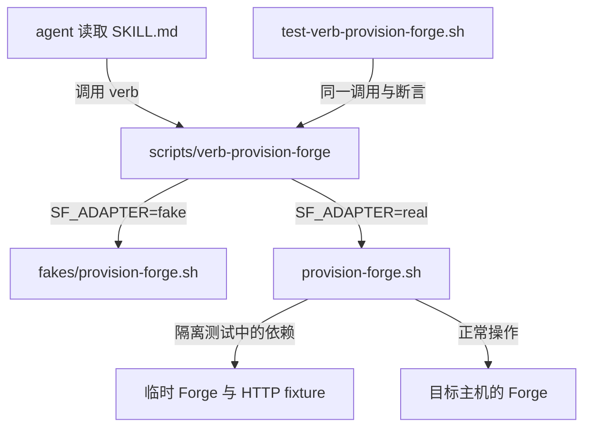

## Context

目标是重写 skill 的执行结构，不是实现文档 checker。Operator verb 是 module；每个 verb 的 wrapper 是 external seam；已有脚本与固定输出的 fake 是两个 adapter。测试调用 wrapper，不解析 SKILL.md 或 spec，也不靠 grep 脚本源代码推断退出码。

已读 ADR-0001 至 ADR-0008。0002 替换了 0001 的安装手段但保留其来源决定；0004 改正 0003 的 ADR 位置；0007 收窄为 lieutenant Forge；0008 保留六个 operator verb。其余在效约束不变。0003 已明确 scenario 尚未自动执行，0005 区分 runbook 与 skill；两者均不要求执行时加载 spec。本 change 补充它们，不 supersede。

基线 `5f6816d`。`test-provision-forge.sh` 已验证部分 STATUS、退出码与报文字段，不能声称旧测试完全不测契约；真正缺少的是一个可切换两个 adapter 的 verb 入口与同一套替换验证。

## Goals / Non-Goals

**Goals:**

- 六个 verb 先具备 fake 可运行的 seam，再按已确认顺序逐个接 real；测试报告区分 fake 已通过和 real 已通过。
- 现有脚本成为 real adapter，执行参数、stdout、stderr、退出码不被 wrapper 偷改。
- SKILL.md 原地改写，agent 不读 issue、spec 或 ADR 也能选择 verb、调用并处理结果。

**Non-Goals:**

- 不移植 attach role，不把 start-swarm.sh 变回公开 verb；不修改 CONTEXT.md 或 AGENTS.md。
- 不加 Kind、文档结构 checker、跨文档退出码对账器、统一 dispatcher 或第三套测试框架。
- 不在本票修复 #178、决定 #179 的诊断用途、补齐所有历史 spec，或改现有生产脚本行为。

## Decisions

### 1. 每个 verb 一个入口，选择 adapter 不改变调用形状

以 `.agents/skills/swarmforge-operator/` 为下列路径的根：

```text
SKILL.md                           # agent 的 verb 入口说明
scripts/
  verb-provision-forge             # 新的 executable wrapper，seam 是 ::main
  provision-forge.sh               # 已有 real adapter，路径不变
  fakes/provision-forge.sh         # 新的固定输出 fake
  test-verb-provision-forge.sh      # 同一组 contract assertions
```

其余 stem 为 `dashboard`、`ship-project`、`wake-role`、`talk-role`、`open-swarm`。唯一不按 stem 匹配的 real 文件是 dashboard 对应 `open-dashboard.sh`。wrapper 定义 `main` 入口并透传 `"$@"`，通过 `SF_ADAPTER=fake|real` 选择固定目标；不用 eval，不把任意环境变量值当命令路径。

放弃一个总 dispatcher：本次要求每次移植一个 verb，应允许逐个 review、切换和回退。wrapper 只承担选择和透传，不能复制脚本里的安装、端口校验、祖先检查或提交验证。



spec、ADR 不在图的执行链上。开发者可读留档；skill 与执行代码不能要求它们存在。

### 2. fake 是固定替身，不是假成功的生产路径

每个 fake 返回一个预定成功样本，不读取 runtime、项目文件或真实凭据，不调用 ssh、cmux、tmux、curl、git、gh。固定样本只覆盖共用的成功 contract，不模拟所有状态机，不长成第二套业务实现。

骨架阶段各 wrapper 默认 fake；fake 使用 stderr 的固定 `ADAPTER=fake` 标识说明未执行真实操作，stdout 保持被测 contract。未完成 real 验证的 verb 不替换 SKILL.md 中的真实操作入口；旧入口继续可用。移植完成后默认切为 real，fake 仍可显式选择，不拆除 seam。

未知 SF_ADAPTER 返回 USAGE/2。选择的 adapter 不存在或不可执行时返回 ERROR/5，不能回退到另一个 adapter，更不能用 fake 掩盖 real 失败。这些是新增 wrapper 的防误用行为，不修改旧脚本的失败处理。

### 3. 同一份 assertions，两个独立准备的环境

每份 test-verb-*.sh 的调用与 contract assertions 相同，切换 adapter 只改变运行参数/环境和 fixture 准备。real fixture 的 setup 可以不同，不能为了让 real 变绿去跳过断言或修改期望结果。

首个共同成功样本的已知结果：

- provision forge：`STATUS=PROVISIONED`，退出 0，`ROOT/FORGE/URL/TARGET` 非空；使用不建 project 的现有成功路径作为固定样本。建 project 的 HTTP 行为由既有回归保持覆盖。
- dashboard：`STATUS=OPENED`，退出 0，`TUNNEL/URL/WORKSPACE/SURFACE/ROOT/TARGET` 非空。
- ship project：`STATUS=PR_OPENED`，退出 0，`url:` 非空；real 在临时 git remote 与 gh stub 下真正走到 PR 创建调用，不能用 DRY_RUN 代替发布成功路径。
- wake role 与 talk role：分别 `STATUS=WOKEN`、`STATUS=SENT`，退出 0，`ROLE/SESSION` 非空。
- open swarm：`STATUS=OPENED`，退出 0，`ROOT/TARGET/WINDOW/WORKSPACES` 非空、`ATTACHED` 大于 0、`FAILED=0`。

不比较动态 root、端口、URL 的逐字值，也不只检查 FAIL=0：套件须实际执行非零数量的 assertions，失败时退出非零。各 verb 的既有报文格式保持，包括 ship project 的 `key: value`，不强行改成统一 key=value。全局 STATUS 首行承诺与真实 stdout 顺序须在每个 real 迁移时核实；发现不符就记录 blocker，不靠吞日志或更换断言隐藏它。

现有七套脚本不是可直接 source 的 fixture library：例如 `test-provision-forge.sh` 在顶层启动 HTTP server 并执行测试。实现时复用其中最小的 setup/stub 形状或确有必要的测试 helper，不 source 整个 runner，不为去重重写七套回归。固定 fake 不能证明 real 的安装、提交或发布确实发生；real 测试须另留调用记录/临时产物证明实际调用旧脚本，没有误接回 fake。

### 4. TDD 与逐个替换

骨架先写六组成功 contract 测试，入口不存在时保存 RED，再加入 wrapper 与 fake 得到 fake GREEN。此时 real 全部标作 pending，不能写“六个 verb 已迁移”。

每次 real 移植先建隔离 fixture，显式选择 real 得到红或如实记录已有脚本直接通过；已有实现第一次就绿时，不伪造失败。default 仍为 fake 时，新增“默认入口实际委托 real”的验收会红，切换该 verb 默认值后应绿。fake/real 共用 contract assertions 不变，额外 delegation 验证防止“永远返回固定成功”也过验收。

行为不匹配时保留旧入口，把该 verb 标为未完成并列出差异。不能修改生产脚本或放宽 contract 来静默过关；如需改变原约定行为，另请授权。

### 5. skill 2.0 的验收面

六个 verb 各自给出用途与不做什么、输入与前置条件、seam 调用示例、结果与失败后的下一步；必要通用约束只说明一次。历史 issue 叙事从执行指令中移走，必要“为什么不能这样做”的规则就地写清。参数样例中的 `#42` 不当作应清除的历史耦合。

人工检查 agent 能只读 skill 完成六个 verb 的选择与调用，不要求先读 spec；代码备注允许留档引用。README 与 runbook 最后指向 SKILL.md，不指向 spec 执行。attach role 原路径保留并明确不属六个移植对象。

自动化只测 wrapper、adapter 与可观察结果，不对 prompt 句子、章节标题或文档措辞写断言。留档中的 seam 身份可用于开发期记录，不能让它成为运行时加载表或本轮 contract 测试的输入。

## Risks / Trade-offs

- fake 绿被误报为生产完成 → stderr 明示 fake、独立记录 real 进度，默认入口切换须有委托证据。
- 新旧行为 contract 暂时不一致 → 每 verb 单独验证，保持旧入口，不能以新增 seam 为由绕过原来的安全检查。
- 多出六个很薄的 wrapper → 这是用户选择的替换入口；不再加 registry、plugin loader 或总 dispatcher。固定 fake 的覆盖很窄，失败路径仍由旧回归验证。
- spec 被误当程序输入 → wrapper/adapter/test 不读 spec；独立打包 skill 后在没有 openspec 的临时目录运行 contract 测试验证。

## Migration Plan

1. proposal、spec、design、ADR、tasks review 后提交并进入 main，再 apply；本轮不实现。
2. 六个 wrapper + 六个 fake + 六份 contract 测试形成全绿骨架，记录 RED/GREEN 输出和基线旧文件清单。
3. 依次迁移 provision forge → dashboard → ship project → wake role → talk role → open swarm。每次完成 real/fake 验证后切换默认 adapter，逐个更新 SKILL.md 的相应调用，不等到最后才暴露已迁移 verb。
4. 最后整体整理 SKILL.md 与 README/runbook 指向，跑六对 contract 验证及原七套回归，人工审核旧文件的每一处 diff。
5. 回退单个迁移时恢复该 verb 的旧 SKILL 调用及此前默认选择，fake 只留测试；绝不以 fake 成功报文代替真实操作。

## Open Questions

没有待用户重新选择的架构问题。以下是实现期必须取证的未知，不是先行声称已完成：各 real fixture 能否直接复用旧测试 setup；所有成功路径的 stdout 顺序；是否出现必须改变旧脚本行为才能满足共同 contract 的差异。出现最后一种情况时停止该 verb 的接入并报告，其余授权内工作可继续。
